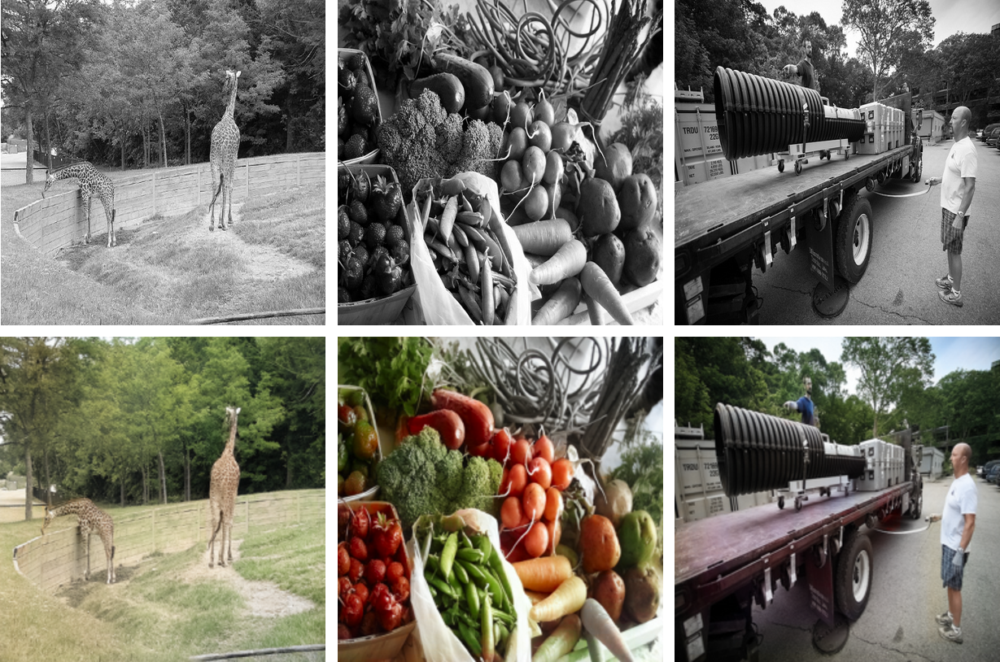

# [CVPR 2020] Instance-aware Image Colorization
[](https://colab.research.google.com/github/ericsujw/InstColorization/blob/master/InstColorization.ipynb)

### [[Paper](https://arxiv.org/abs/2005.10825)] [[Project Website](https://ericsujw.github.io/InstColorization/)] [[Google Colab](https://colab.research.google.com/github/ericsujw/InstColorization/blob/master/InstColorization.ipynb)]

<p align='center'>

</p>

Image colorization is inherently an ill-posed problem with multi-modal uncertainty. Previous methods leverage the deep neural network to map input grayscale images to plausible color outputs directly. Although these learning-based methods have shown impressive performance, they usually fail on the input images that contain multiple objects. The leading cause is that existing models perform learning and colorization on the entire image. In the absence of a clear figure-ground separation, these models cannot effectively locate and learn meaningful object-level semantics. In this paper, we propose a method for achieving instance-aware colorization. Our network architecture leverages an off-the-shelf object detector to obtain cropped object images and uses an instance colorization network to extract object-level features. We use a similar network to extract the full-image features and apply a fusion module to full object-level and image-level features to predict the final colors. Both colorization networks and fusion modules are learned from a large-scale dataset. Experimental results show that our work outperforms existing methods on different quality metrics and achieves state-of-the-art performance on image colorization.


**Instance-aware Image Colorization**
<br/>
[Jheng-Wei Su](https://github.com/ericsujw), 
[Hung-Kuo Chu](https://cgv.cs.nthu.edu.tw/hkchu/), and 
[Jia-Bin Huang](https://filebox.ece.vt.edu/~jbhuang/)
<br/>
In IEEE Conference on Computer Vision and Pattern Recognition (CVPR), 2020.

## Prerequisites
* [CUDA 10.1](https://developer.nvidia.com/cuda-10.1-download-archive-update2)
* Python3
* Pytorch >= 1.5
* Detectron2
* OpenCV-Python
* Pillow/scikit-image
* Please refer to the [env.yml](env.yml) for detail dependencies.

## Getting Started
1. Clone this repo:
```sh
git clone https://github.com/ericsujw/InstColorization
cd InstColorization
```
2. Install [conda](https://www.anaconda.com/).
3. Install all the dependencies
```sh
conda env create --file env.yml
```
4. Switch to the conda environment
```sh
conda activate instacolorization
```
5. Install other dependencies
```sh
sh scripts/install.sh
```

## Dataset Preparation
### COCOStuff
1. Download and unzip the COCOStuff training set:
```sh
sh scripts/prepare_cocostuff.sh
```
2. Now the COCOStuff train set would place in [train_data](train_data).

### Your own Dataset
1. If you want to train on your dataset, you should change the dataset path in [scripts/prepare_train_box.sh's L1](scripts/prepare_train_box.sh#L1) and in [scripts/train.sh's L1](scripts/train.sh#L1).

## Pretrained Model
1. Download it from [google drive](https://drive.google.com/open?id=1Xb-DKAA9ibCVLqm8teKd1MWk6imjwTBh).
```sh
sh scripts/download_model.sh
```
2. Now the pretrained models would place in [checkpoints](checkpoints).

## Instance Prediction
Please follow the command below to predict all the bounding boxes fo the images in `${DATASET_DIR}` folder.
```sh
sh scripts/prepare_train_box.sh
```
All the prediction results would save in `${DATASET_DIR}_bbox` folder.

## Training the Instance-aware Image Colorization model
Simply run the following command, then the training pipeline would get start.
```sh
sh scripts/train.sh
```
To view training results and loss plots, run `visdom -port 8098` and click the URL http://localhost:8098.

This is a 3 stage training process.
1. We would start to train our full image colorization branch based on the [siggraph_retrained's pretrained weight](https://github.com/richzhang/colorization-pytorch).
2. We would use the full image colorization branch's weight as our instance colorization branch's pretrained weight.
3. Finally, we would train the fusion module.

## Testing the Instance-aware Image Colorization model
1. Our model's weight would place in [checkpoints/coco_mask](checkpoints/coco_mask).
2. Change the checkpoint's path in [test_fusion.py's L38](test_fusion.py#L38) from `coco_finetuned_mask_256_ffs` to `coco_mask`
3. Please follow the command below to colorize all the images in `example` foler based on the weight placed in `coco_mask`.

    ```
    python test_fusion.py --name test_fusion --sample_p 1.0 --model fusion --fineSize 256 --test_img_dir example --results_img_dir results
    ```
    All the colorized results would save in `results` folder.

## License
This work is licensed under MIT License. See [LICENSE](LICENSE) for details. 

## Citation
If you find our code/models useful, please consider citing our paper:
```
@inproceedings{Su-CVPR-2020,
  author = {Su, Jheng-Wei and Chu, Hung-Kuo and Huang, Jia-Bin},
  title = {Instance-aware Image Colorization},
  booktitle = {IEEE Conference on Computer Vision and Pattern Recognition (CVPR)},
  year = {2020}
}
```

## Acknowledgments
Our code borrows heavily from the amazing [colorization-pytorch](https://github.com/richzhang/colorization-pytorch) repository.
